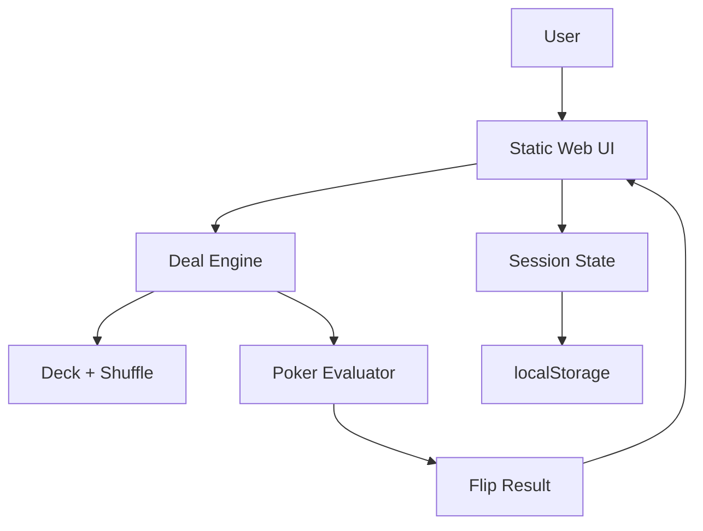

# Poker All-in Flip

テキサスホールデムのプリフロップオールインを、1人または2人で手軽に試すためのWebアプリです。

## 目的

- 1人モード: CPU相手にプリフロップオールインを繰り返し、短期的にどれだけ運が良い/悪いかを見る
- 2人モード: 近くにいる2人が1つの画面を見ながら、ランダム配布されたハンド同士の勝敗を決める
- 将来拡張: プレイヤーごとのハンド指定、レンジ指定、勝率表示、セッション履歴などを追加できるようにする

## 初期スコープ

まずは「ランダム2ハンドを配って、5枚のボードを開き、勝敗を表示する」ことに集中します。

- テキサスホールデムとして、プレイヤーAとプレイヤーBにホールカードを2枚ずつ配る
- 初期版では、両プレイヤーのホールカードはランダムにする
- 初期版では、フロップ、ターン、リバーのボード5枚もランダムにする
- 1デッキ52枚から重複なしで配る
- 勝者、役、引き分けを表示する
- ボードを1枚ずつ公開し、その時点の勝率と役を表示する
- 1人モードでは自分 vs CPU として結果を記録する
- 2人モードではPlayer 1 vs Player 2として結果を表示する
- セッション中の勝敗と勝率を表示する
- 勝ち数と直近履歴をブラウザに保存する

## ドキュメント

- [Product Spec](docs/product-spec.md)
- [Development Plan](docs/development-plan.md)
- [Git Workflow](docs/git-workflow.md)
- [Hosting Comparison](docs/hosting-comparison.md)
- [Owner Tasks](docs/owner-tasks.md)
- [Open Questions](docs/open-questions.md)

## 推奨する作り方

フロントエンドだけで成立するアプリとして始めます。ユーザー登録やサーバー保存が不要な間は、静的サイトとしてVercelに公開できます。

- 現在のMVP: 依存なしの静的HTML/CSS/JavaScript
- 将来候補: Vite + React + TypeScript
- 役判定: MVPではローカル実装、将来は評価ライブラリへの置き換えを検討
- 公開: Vercelを優先候補にする
- ローカル確認: `develop` ブランチで `python3 -m http.server 5173`

## ローカル確認

```bash
cd /Users/ogamon/workspace/poker-allin-flip
python3 -m http.server 5173
```

ブラウザで以下を開きます。

```text
http://localhost:5173
```

## 完成時にREADMEへ載せたいもの

実装が固まったら、READMEにアーキテクチャ図を載せます。GitHub上でそのまま表示できるように、まずは Mermaid の図として管理する想定です。

載せたい図:

- 画面コンポーネント構成
- カード配布から勝敗判定までの処理フロー
- `main` 公開、`develop` 開発、PR反映のブランチ運用

初期案:


