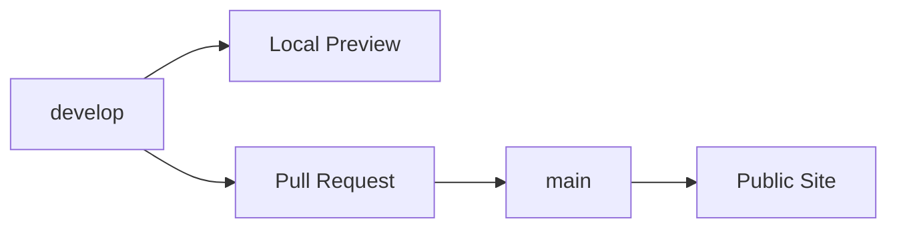

# Development Plan

## 推奨技術

### 現在のMVP

- HTML
- CSS
- JavaScript
- Vercel Static Deployment

理由:

- 現在のローカル環境に `node` / `npm` がない状態でも実装と確認を進められる
- 初期機能はフロントエンドだけで成立する
- Vercelに静的サイトとして公開しやすい
- あとでVite + React + TypeScriptへ移行できる

### フロントエンド

- Vite
- React
- TypeScript
- CSS Modules または Tailwind CSS

理由:

- 静的サイトとして公開しやすい
- ローカル開発が速い
- 将来ハンド指定や履歴表示を足しやすい
- TypeScriptでカード/役/結果の型を明確にできる

これは将来の移行候補です。MVPは依存なしの静的サイトとして実装します。

### ポーカー判定

長期的には、実績のあるライブラリを使うのが安全です。ポーカーの役判定はキッカー比較やチョップ判定でバグが入りやすいためです。

MVPでは、7枚から5枚の全組み合わせを評価する小さなローカル実装で始めます。将来、テストケースを増やしたうえでライブラリへの置き換えを検討します。

候補:

- `pokersolver`
- `poker-evaluator`
- `phe`

選定時に見る点:

- Texas Hold'em の7枚評価に対応しているか
- TypeScriptで扱いやすいか
- メンテナンス状況
- カード表記の変換が簡単か
- ブラウザで動かしやすいか

## データモデル案

```ts
type Suit = "s" | "h" | "d" | "c";
type Rank = "2" | "3" | "4" | "5" | "6" | "7" | "8" | "9" | "T" | "J" | "Q" | "K" | "A";

type Card = {
  rank: Rank;
  suit: Suit;
};

type Player = {
  id: "player1" | "player2" | "cpu";
  name: string;
  holeCards: Card[];
};

type FlipResult = {
  players: Player[];
  board: Card[];
  winnerIds: string[];
  handDescriptions: Record<string, string>;
};
```

## MVP実装ステップ

1. 依存なしの静的HTML/CSS/JavaScriptでMVPを作る
2. カード、デッキ、シャッフル処理を作る
3. テキサスホールデム形式で、ランダムに2人分のホールカード2枚ずつとボード5枚を配る
4. 7枚から最強5枚役を評価する処理を作る
5. 勝者と役名を表示する
6. 1人モード/2人モードを切り替える
7. セッション統計を表示する
8. スマホ、タブレット、PCで見やすいUIに整える
9. GitHubに公開用リポジトリを接続する
10. `main` と `develop` のブランチ運用を始める

## ディレクトリ構成案

```text
poker-allin-flip/
  index.html
  src/
    app.js
    styles.css
  docs/
  vercel.json
  README.md
```

## アーキテクチャ図

完成時には README にアーキテクチャ図を載せます。GitHubでそのまま表示しやすいので、まずは Mermaid を使います。

READMEに載せる候補:

- UI構成図
- データフロー図
- ブランチ/デプロイ運用図

データフローの初期案:

```mermaid
flowchart LR
  Mode[Mode Selection] --> Flip[Start Flip]
  Flip --> Deck[Create 52-card Deck]
  Deck --> Shuffle[Shuffle]
  Shuffle --> Hole[Deal 2 Hole Cards Each]
  Hole --> Board[Deal 5 Board Cards]
  Board --> Eval[Evaluate Best 5-card Hands]
  Eval --> Winner[Decide Winner or Chop]
  Winner --> Stats[Update Session Stats]
  Stats --> Render[Render Result]
```



ブランチ運用の初期案:



## テストしたい要素

- デッキが52枚で重複しない
- ランダム配布後に同じカードが重複しない
- 2人分のホールカード4枚とボード5枚、合計9枚が配られる
- 役判定が代表ケースで正しい
- チョップを正しく判定できる
- セッション統計が正しく更新される
- ハンド指定時に不正入力を弾ける

代表テストケース:

- AA vs KK
- AKs vs QQ
- 同じストレートでチョップ
- フラッシュ同士のキッカー勝負
- フルハウス同士のランク比較
- ボードロイヤルでチョップ

## ローカル確認

実装後は以下の流れにします。

```bash
python3 -m http.server 5173
```

以下で確認できます。

```text
http://localhost:5173
```

## 公開方法の候補

### GitHub Pages

向いている点:

- `main` ブランチ公開と相性が良い
- 静的サイトなら無料で十分
- GitHub上で完結しやすい

注意点:

- Viteの `base` 設定が必要になることがある
- PRプレビューは別途工夫が必要

### Vercel

向いている点:

- PRごとのプレビューURLが自動で出る
- `main` を本番、`develop` をプレビューとして扱いやすい
- React/Viteとの相性が良い

注意点:

- Vercelアカウント連携が必要

## 最初の実装で避けること

- サーバーサイド実装
- ログイン
- DB保存
- オンライン対戦
- 複雑なレンジエディタ
- 自前の完全なポーカー役判定

まずはフロントエンドだけで、気持ちよく何度もフリップできる体験を作ります。
